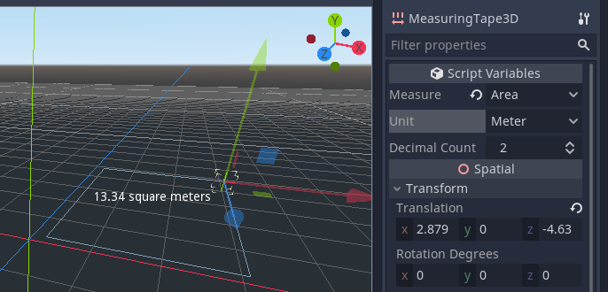
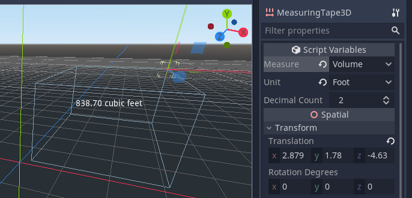
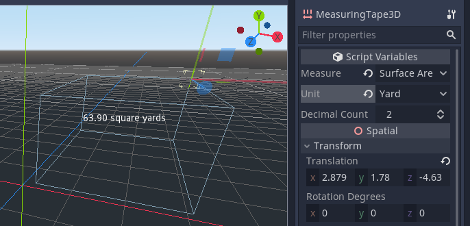
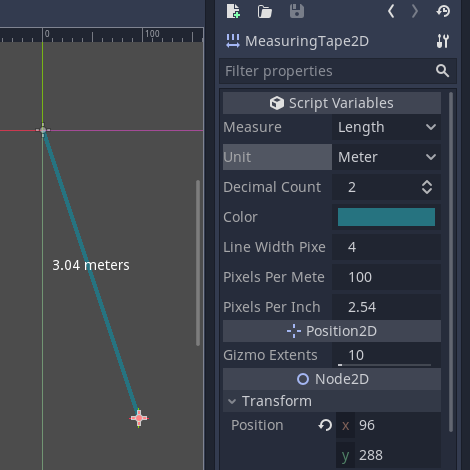
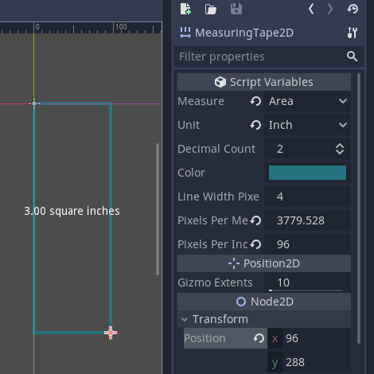

# Godot Measuring Tape

A tool for measuring things in Godot, using the positions
of the measurement node and its parent node.

Check out this tool on the Godot Asset Library:
https://godotengine.org/asset-library/asset/818

These measurement types are supported:

* Length
* Area
* Perimeter
* Volume
* Surface area

These unit types are supported:

* Meters
* Millimeters
* Centimeters
* Kilometers
* Hammer units (the Source engine's units).
* Inches
* Feet
* Feet and inches
* Yards
* Miles
* Light seconds
* Light nanoseconds
* Hectares (area)
* Acres (area)
* Liters (volume)
* Gallons (volume)

With 2D, you can set your own scale using pixels per meter, or PPI/DPI. The
default is 100 pixels per meter, which correlates with Godot's default gravity
setting, but if you are measuring UI elements you may wish to set to your DPI.

